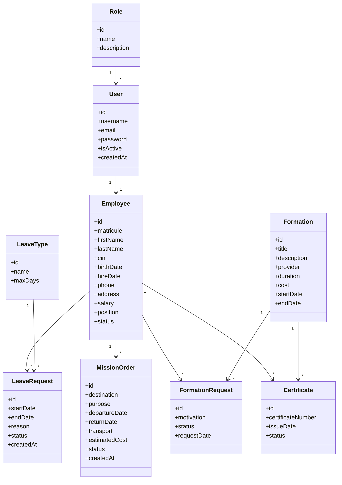

# Human Resources Management System (HRMS)

## Project Specification (Cahier des Charges)

**Version:** 1.0

**Technology Stack**

### Backend

* Node.js
* Express.js
* TypeScript
* TypeORM
* Oracle Database
* JWT Authentication

### Frontend

* Next.js
* TypeScript
* Axios

---

# 1. Project Overview

## 1.1 Introduction

The objective of this project is to develop a Human Resources Management System (HRMS) that enables a company to manage employees and HR processes through a secure web application.

The application must provide a modern REST API developed with Node.js and Express.js, connected to an Oracle database using TypeORM. A frontend developed with Next.js will consume the API and provide a user-friendly interface.

The project will be developed progressively during the training and will cover all concepts presented throughout the course.

---

# 2. Objectives

By the end of this project, students should be able to:

* Design a REST API
* Build a layered architecture
* Use Express.js
* Use TypeORM with Oracle
* Implement JWT Authentication
* Create secure APIs
* Implement Middleware
* Consume APIs from a frontend
* Protect frontend pages
* Build a complete enterprise application

---

# 3. Technologies

## Backend

* Node.js
* Express.js
* TypeScript
* TypeORM
* Oracle Database
* JWT
* bcrypt

## Frontend

* Next.js
* TypeScript
* Axios

---

# 4. User Roles

The application must support three different roles.

## Administrator

Permissions

* Manage Users
* Manage Roles
* Manage Employees
* Manage Leave Types
* Manage Trainings
* View all requests
* Approve or Reject requests
* Access Dashboard

---

## HR

Permissions

* Manage Employees
* Manage Leave Requests
* Manage Mission Orders
* Manage Trainings
* Validate Training Requests
* Access Dashboard

---

## Employee

Permissions

* Login
* View Personal Profile
* Submit Leave Requests
* Submit Mission Orders
* Submit Training Requests
* View Request History

---

# 5. Functional Modules

The application consists of the following modules.

* Authentication
* Dashboard
* Employee Management
* User Management
* Role Management
* Leave Types
* Leave Requests
* Mission Orders
* Training Catalog
* Training Requests
* Certificates

---

# 6. UML Class Diagram



---

# 7. Application Pages

## Authentication

### Login

Fields

* Email
* Password

Actions

* Login

---

### Profile

Display

* Employee Information
* User Information
* Assigned Role

Actions

* Change Password

---

# 8. Dashboard

The dashboard should display important statistics.

Widgets

* Total Employees
* Total Users
* Total Leave Requests
* Pending Leave Requests
* Approved Leave Requests
* Total Mission Orders
* Pending Mission Orders
* Total Trainings
* Pending Training Requests

Recent Activities

* Latest Leave Requests
* Latest Mission Orders
* Latest Training Requests

---

# 9. Employee Management

## Employee List

Display

* Matricule
* First Name
* Last Name
* CIN
* Position
* Status

Actions

* Create
* Edit
* Delete
* View Details

Search

* By Name
* By Matricule
* By Position

Filters

* Status

Pagination

* Yes

---

## Employee Form

Fields

* Matricule
* First Name
* Last Name
* CIN
* Birth Date
* Hire Date
* Phone
* Address
* Position
* Salary
* Status

Validation

* Required fields
* Unique Matricule
* Unique CIN

```
```
